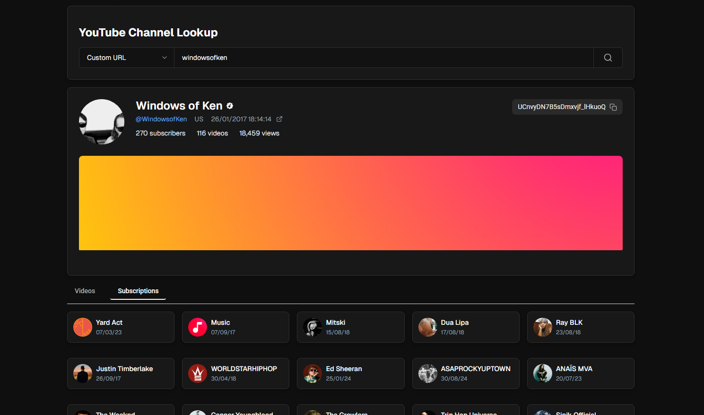
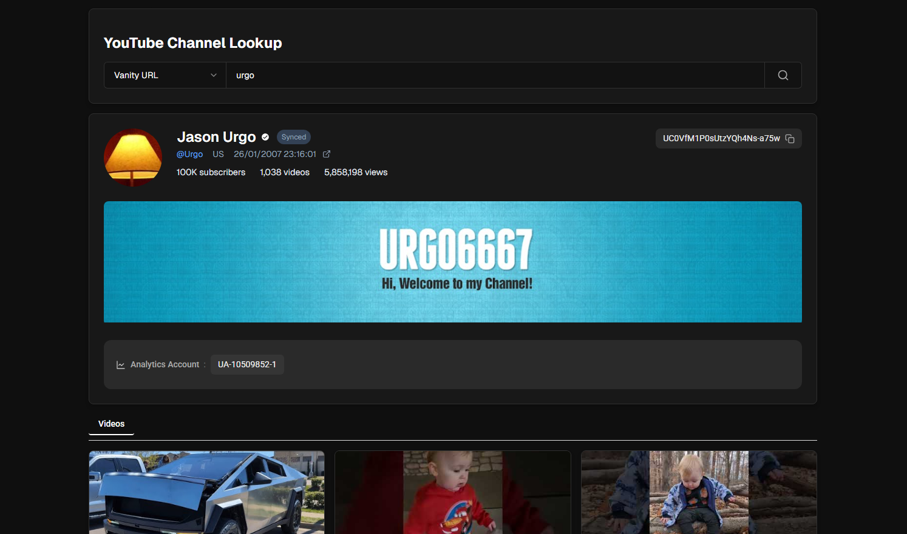
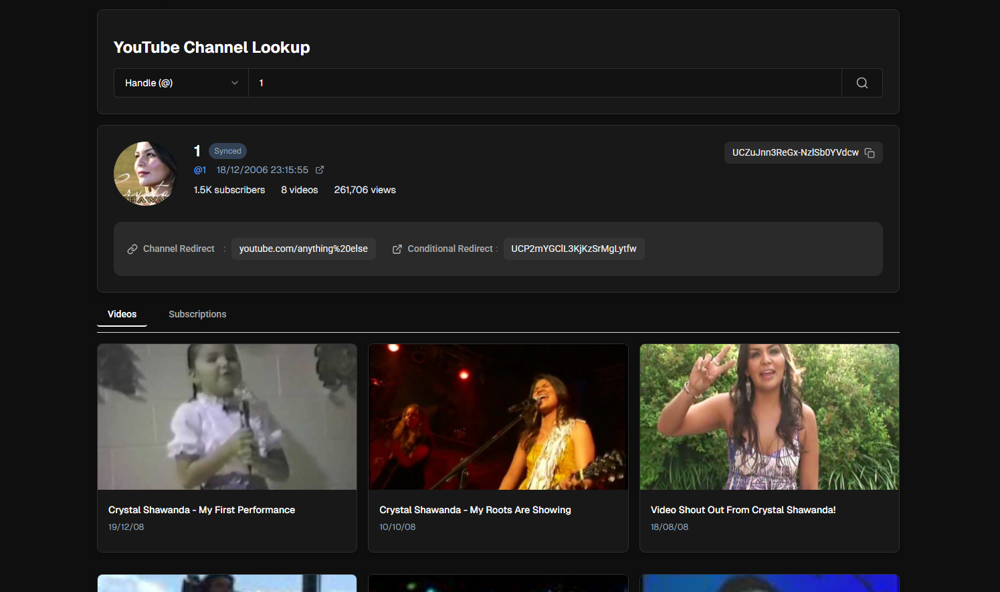

# youtube-lookup



## Description

youtube-lookup is a Rust tool to lookup a channel by the **custom url**, **handle**, **username**, **vanity** and **channel ID** and provide as much metadata as possible

**It supports:**
- channel/conditional redirect detection
- subscriptions
- blocked countries list

... and so much more!


## Installation (docker)

1. Update `.env` with your YouTube Data API key

```
$ echo "API_KEY=your_youtube_api_key_here" > .env
```

2. Build the docker container

```
$ sudo docker build -t youtube-lookup .
```

3. Run docker container

```
$ sudo docker run --env-file .env -p 3000:3000 youtube-lookup
```

The frontend & API should be running on `0.0.0.0:3000`

## More Screenshots





